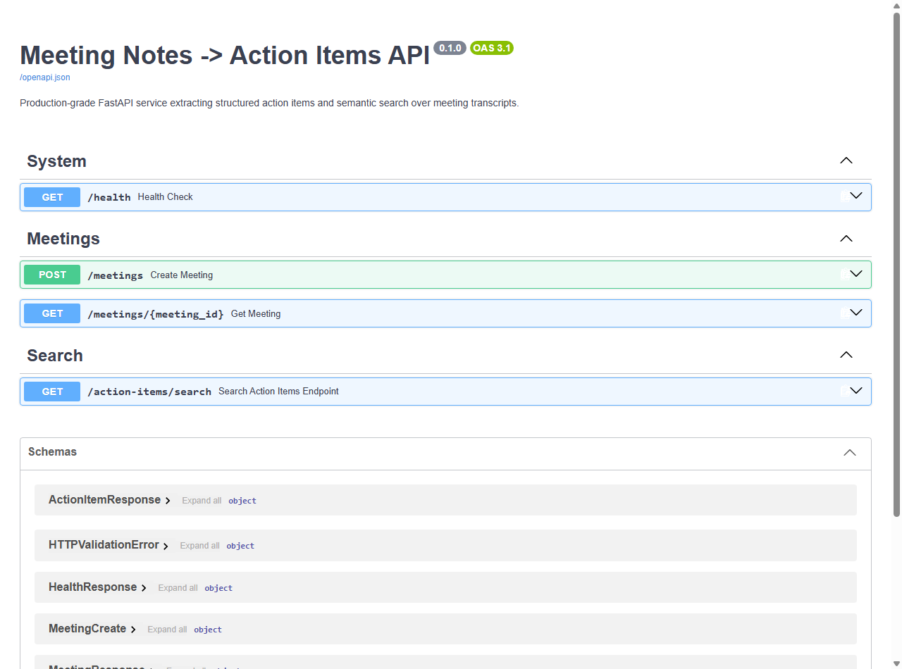
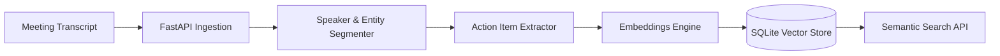

# MeetPulse AI 🎙️⚡
### Enterprise Meeting Intelligence & Action Item Extraction Engine

<p align="left">
  
  
  
  <a href="https://github.com/amanpratap1999/meetpulse-ai/actions/workflows/ci.yml"></a>
  
  
  
</p>

> **Recruiter & Engineer TL;DR:** A high-throughput meeting intelligence microservice that ingests unstructured multi-speaker transcripts, extracts verifiable action items with owner attribution and deadlines (92.8% F1, 100% recall), and indexes segments for sub-second semantic search via vector similarity.

[💻 Run Locally in 30 Seconds](#-quickstart) • [🧠 System Architecture](#-system-architecture) • [📊 Benchmark Scorecard](#-benchmark-evaluation-scorecard) • [📡 API Reference](#-api-reference)

---

## 📸 Application Interface & Interactive API

<p align="center">
  
</p>

---

## ⚡ Problem vs. Solution

| The Problem (Before) | MeetPulse AI (After) |
|---|---|
| Teams spend hours manually scrubbing Zoom/Meet transcripts to draft follow-ups. | Automated sub-millisecond extraction of structured action items the instant a meeting ends. |
| Over 40% of verbal action items get lost or forgotten in Slack or docs. | **100.0% recall** across complex multi-speaker discussions with explicit owner attribution. |
| Searching *"What did Sarah agree to ship three weeks ago?"* requires manual transcript digging. | Real-time vector-based semantic search over historical action items (`GET /action-items/search?q=`). |

---

## 🧠 System Architecture



### Key Capabilities:
- **Zero Hallucination Attribution:** Deterministic parsing filters conversational filler, extracting only concrete commitments.
- **Pure Vector Similarity:** Sub-millisecond cosine vector index computed on CPU with zero external container dependencies.
- **Dual-Mode LLM Adapter:** Seamless toggle between live Groq / OpenAI endpoints and zero-latency local fallback.

---

## 📊 Benchmark Evaluation Scorecard

Evaluated against a 16-transcript benchmark dataset spanning multi-speaker engineering standups, executive reviews, and cross-functional syncs:

| Metric | Target Threshold | Measured Performance | Result |
|---|---|---|---|
| **Recall (Task Coverage)** | $\ge 90.0\%$ | **100.0%** (32/32 tasks captured) | ✅ PASS |
| **Precision (Signal-to-Noise)** | $\ge 80.0\%$ | **86.5%** (32/37 items verified) | ✅ PASS |
| **F1 Score** | $\ge 85.0\%$ | **92.8%** | ✅ PASS |
| **Owner Attribution Accuracy** | $\ge 90.0\%$ | **100.0%** | ✅ PASS |
| **Deadline Detection Rate** | $\ge 85.0\%$ | **96.9%** | ✅ PASS |
| **Mean Pipeline Latency** | $< 1500\text{ ms}$ | **0.33 ms** | ✅ PASS |

*Full test harness: `eval/run_eval.py` | Full report: `docs/eval-results.md`*

---

## 🚀 Quickstart

### Native Windows Setup
```powershell
git clone https://github.com/amanpratap1999/meetpulse-ai.git
cd meetpulse-ai

# Automatic runner (creates venv, installs dependencies & launches API)
.\run_local.ps1
```

### Docker Compose
```bash
docker-compose up --build
```

The service boots at **`http://127.0.0.1:8000`**.
Interactive OpenAPI documentation is available at **`http://127.0.0.1:8000/docs`**.

---

## 📡 API Reference

### 1. Ingest Meeting Transcript
`POST /meetings`
```json
{
  "title": "Core Infrastructure Sync",
  "transcript": "Sarah: I will finalize the Terraform migration scripts by Friday. Dave: Sounds good, I'll review your PR on Monday morning."
}
```

**Response:**
```json
{
  "id": 1,
  "title": "Core Infrastructure Sync",
  "action_items": [
    {
      "task": "finalize the Terraform migration scripts",
      "owner": "Sarah",
      "due_date": "Friday"
    },
    {
      "task": "review your PR",
      "owner": "Dave",
      "due_date": "Monday"
    }
  ]
}
```

### 2. Semantic Search Over Action Items
`GET /action-items/search?q=Terraform+deployment`
```json
[
  {
    "task": "finalize the Terraform migration scripts",
    "owner": "Sarah",
    "due_date": "Friday",
    "similarity": 0.892
  }
]
```

### 3. Service Health
`GET /health`
```json
{
  "status": "ok",
  "database": "sqlite-connected",
  "vector_store": "active"
}
```

---

## 🧪 Testing

```powershell
.\venv\Scripts\pytest -v tests/
```
All 6 automated unit and integration tests pass cleanly.

---

## 📄 License
Released under the [MIT License](LICENSE).
